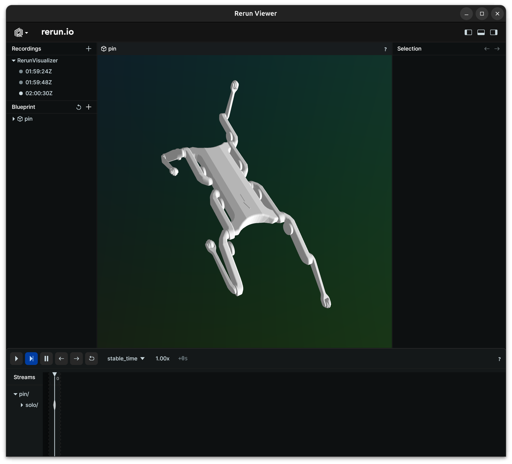

# pinocchio-rerun

This is a renderer project for Pinocchio based on [rerun](https://github.com/rerun-io/rerun).



## Quickstart

This project requires [Pinocchio](https://github.com/stack-of-tasks/pinocchio) and [HPP-FCL]() (Pinocchio and HPP-FCL would suffice).

The Rerun viewer needs to be installed for visualizations to work. Follow their [Getting Started](https://github.com/rerun-io/rerun/tree/main#getting-started) to see how to install it.

Moreover, this requires the [Rerun Python SDK](https://www.rerun.io/docs/getting-started/quick-start/python). It can be installed from conda-forge as follows:

```bash
conda install -c conda-forge rerun-sdk
```

### Compiling from source

This repo aims at becoming a part of Pinocchio, however, I would like to package it as a python package when I have time